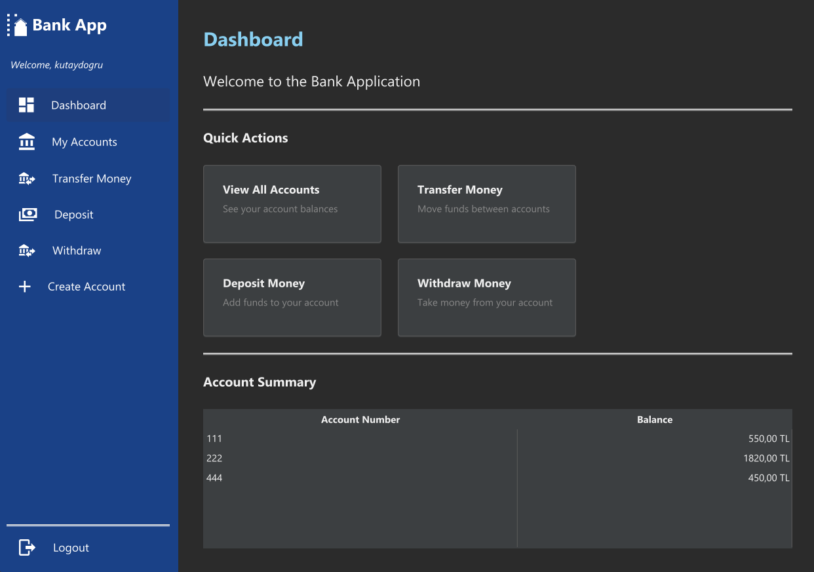
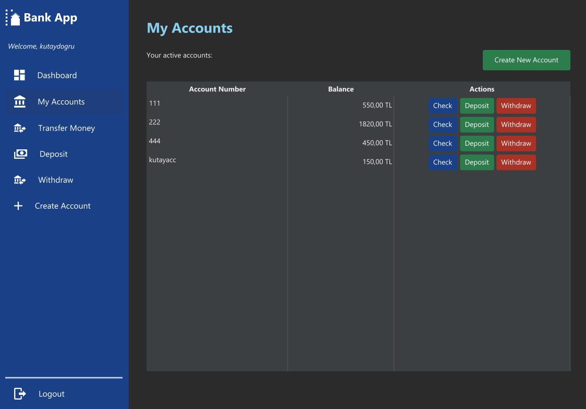
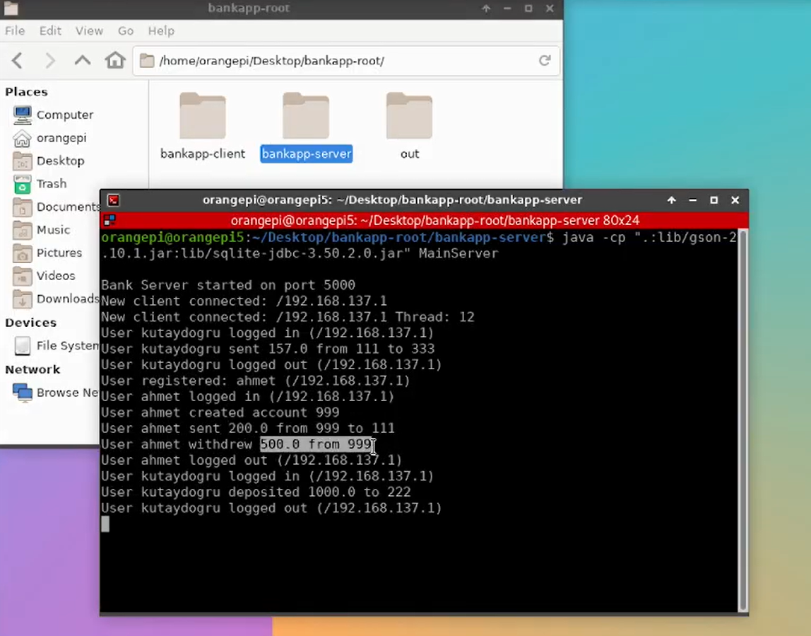

# BankApp - GUI-Based Bank Account Fund Transfer Simulation over TCP Sockets

##  Project Overview

**BankApp** is a comprehensive desktop banking simulation project featuring a JavaFX-based GUI and a TCP socket-powered, multithreaded client-server architecture.  
The system enables users to create accounts, view balances, transfer funds, and review transaction history, all via a modern interface and robust backend.

Designed for educational and demonstration purposes, it showcases real-world development patterns, including concurrency, network programming, and persistent data storage.

A key highlight is its **multithreaded server**: every client connection is handled in a separate thread, supporting concurrent sessions and realistic banking operations. 

The server can run on standard computers or on embedded hardware like **Orange Pi**, making this solution versatile for both educational and low-cost deployment scenarios.

---

##  Features

-  **Multithreaded TCP Server:** Simultaneous connections, each managed in a dedicated thread  
-  **Modern JavaFX GUI:** Interactive, responsive user interface for account and fund management  
-  **Persistent Storage:** All account and transaction data stored in a local SQLite database (via JDBC)  
-  **Intuitive Workflow:** Account creation, login, balance queries, transaction history display, and secure fund transfer  
-  **Robust Error Handling:** Informative feedback for invalid actions (e.g., insufficient funds, duplicate accounts)  
-  **Shared Logic:** `common/` modules ensure synchronized data structures and communication protocol  
-  **Separation of Concerns:** Clear division between client, server, and shared code for maintainability and testing  

---


## Screenshots

<div align="center">
  <div>
    
    
  </div>
  
  <br>
  
  <div>
    <h3>Server Terminal</h3>
    
  </div>
</div>

## Hardware Compatibility

- **Server Flexibility:** While the server can run on any standard computer (Windows, Linux, macOS), it has been specifically tested and optimized for the **Orange Pi** single-board computer, providing a low-cost, energy-efficient server solution.
- **Embedded Deployment:** Using an Orange Pi as the server node allows the system to be deployed in constrained environments where full desktop hardware would be impractical or cost-prohibitive.
- **Performance Considerations:** The multithreaded architecture ensures good performance even on the limited resources of the Orange Pi, allowing multiple simultaneous client connections.

---
  
## Building and Running the Project

Below are step-by-step instructions to compile and run both the server and client.  
Replace `[bankapp-root]` with your actual project root directory.


###  Server

####  Compile

```bash
cd [bankapp-root]/bankapp-server

javac -cp ".:lib/gson-2.10.1.jar:lib/sqlite-jdbc-3.50.2.0.jar" -d . common/*.java server/dao/*.java server/services/*.java server/net/*.java MainServer.java

```

####  Run

```bash
cd [bankapp-root]/bankapp-server

java -cp ".:lib/gson-2.10.1.jar:lib/sqlite-jdbc-3.50.2.0.jar" MainServer
```

The server will initialize the SQLite database and start listening for client TCP connections.

---

###  Client

####  Set JavaFX Path

```bash
# Windows CMD (use this in Command Prompt)
set PATH=C:\Path\To\javafx-sdk-24.0.2\bin;%PATH%
```

####  Compile

```bash
cd [bankapp-root]/bankapp-client

javac --module-path lib --add-modules javafx.controls,javafx.fxml,javafx.web,javafx.media -cp "lib\json-20240303.jar;lib\gson-2.10.1.jar;lib\sqlite-jdbc-3.50.2.0.jar" -d out client\gui\*.java client\net\*.java common\*.java
```

####  Run

```bash
# Windows CMD (use this in Command Prompt)
set PATH=C:\Path\To\javafx-sdk-24.0.2\bin;%PATH%

java --enable-native-access=ALL-UNNAMED,javafx.graphics -Dprism.verbose=true -Dprism.order=sw,es2,d3d,j2d -Djavafx.verbose=true --module-path lib --add-modules javafx.controls,javafx.fxml,javafx.web,javafx.media -cp "out;lib\json-20240303.jar;lib\gson-2.10.1.jar;lib\sqlite-jdbc-3.50.2.0.jar" client.gui.MainApp

```

You may launch multiple client instances to demonstrate multithreading.

---

##  Usage Flow

1. **Start the server** on your local machine or networked host  
2. **Launch one or more clients** from the same or other computers  
3. **Register or log in** through the GUI  
4. **Perform banking operations:** create accounts, transfer funds, check balances, view history  
5. All client requests are processed concurrently (server creates a thread for each), with database-backed persistence and error management.

**Note:** For clients to connect to the server, they need to be on the same network or have appropriate routing. The server listens on port 5000, which should be accessible from client machines. If connecting across different networks, port forwarding may be required.  

---

##  Architecture Highlights

-  **Multithreaded server:** Each client is handled in a separate thread
-  **Client-server communication:** Data is transferred as JSON objects over TCP sockets using a custom protocol defined in the shared `common/` module. Communication takes place over **Ethernet connection on port 5000**, allowing for both local network and potential internet deployment with proper port forwarding.
-  **Persistence:**  All data is stored in a **SQLite** database managed through the DAO (Data Access Object) pattern for reliability and testability 
-  **JavaFX UI:** Clean, functional GUI for end-user interactions  

---

##  Notes

-  This project is for **educational use only** — not secure or production-ready  
-  Ensure proper Java/JavaFX versions are installed and paths are correctly set  
-  Designed to demonstrate multithreaded networking, database interaction, and GUI in Java  


